<h3><code>devamsh@github ~ $ ./contributions.sh</code></h3>

  

<h3><code>devamsh@github ~ $ whoami</code></h3>
<table>
  <tr>
    <td valign="top"></td>
    <td valign="top"></td>
  </tr>
</table>

 

---

### 💻 Tech Stack

**Backend & Languages**
 

**Backend Frameworks & Tools**
 

**Databases**
 

**Dev Tools**
 

---

### 🏆 GitHub Trophies

---

